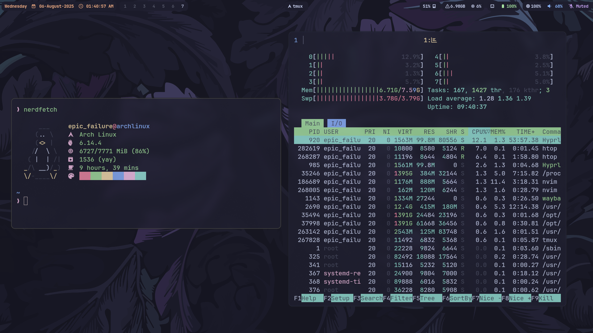

# Hyprland Setup

My personal Hyprland rice, optimized for speed, clarity, and usability.  
Built on Arch Linux. Focused on clean visuals, practical keybindings, and minimal distractions.

---

## 🧠 Features

- Tiling window manager with **dwindle** layout
- **Waybar** with workspace icons and system stats
- **SWWW** for fast animated wallpapers
- **Tofi** for minimalist app launcher
- **Dunst** for notifications
- **Cliphist** clipboard history
- **Grimblast** for screenshots
- **Hyprlock** for locking screen
- **Hypridle** for idle behavior
- **Catppuccin Mocha** theming (system-wide)

---

## 🚀 Autostarted Services

- `dunst` (notifications)
- `waybar` (status bar)
- `swww` (wallpaper daemon)
- `cliphist` (clipboard monitor)
- `hyprlock` (lockscreen)
- `hypridle` (idle management)
- `polkit-kde` agent for authentication
- `setxkbmap` to enable NumLock on boot

---

## 🛠️ Keybindings

| Action                | Keybind             |
| --------------------- | ------------------- |
| Terminal (Kitty)      | `SUPER + T`         |
| Browser (Brave)       | `SUPER + B`         |
| Notes (Obsidian)      | `SUPER + O`         |
| Code Editor (VSCode)  | `SUPER + C`         |
| File Manager (Thunar) | `SUPER + F`         |
| Emoji Picker          | `SUPER + E`         |
| App Launcher (Tofi)   | `SUPER + A`         |
| Toggle Floating       | `SUPER + W`         |
| Kill Active Window    | `SUPER + Q`         |
| Screenshot (Active)   | `SUPER + Print`     |
| Screenshot (Area)     | `SUPER + SHIFT + S` |
| Clipboard Menu        | `SUPER + V`         |
| Lock Screen           | `SUPER + L`         |
| Exit Menu (wlogout)   | `SUPER + ESC`       |
| Toggle Waybar         | `CTRL + ESC`        |

---

## 🧩 Applications

| App             | Purpose            |
| --------------- | ------------------ |
| `kitty`         | Terminal           |
| `thunar`        | File manager       |
| `brave`         | Browser            |
| `obsidian`      | Notes              |
| `code`          | Main editor        |
| `subl`          | Alternate editor   |
| `tofi`          | App launcher       |
| `grimblast`     | Screenshots        |
| `cliphist`      | Clipboard history  |
| `hyprpicker`    | Color picker       |
| `pamixer`       | Volume control     |
| `brightnessctl` | Brightness control |

---

## 🎨 Theming

- Cursor: `Cascadia-Code`
- GTK/QT: `Catppuccin-Mocha`
- Font: `Cascadia Code`
- Icon Packs: Use any Nerd Font (recommended)

---

## 📸 Preview

---

## 🧪 Tested On

- Arch Linux
- Hyprland (latest)
- Wayland
- Nvidia (with proper env vars)
